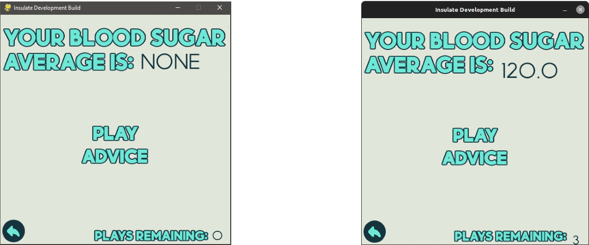
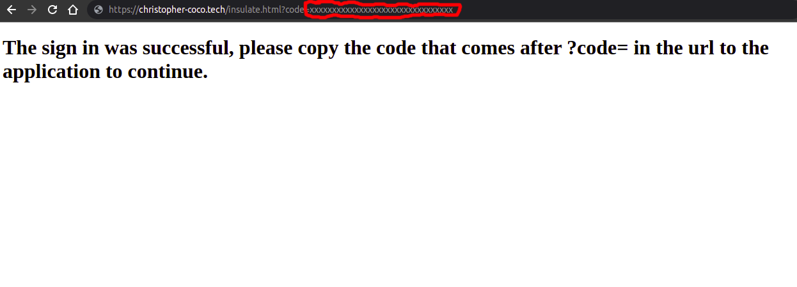

# Insulate
Insulate is a Diabetes application targeted to motivate and help children consistently have good blood sugars. This app was developed for my senior year project design class project. 

## Installation Instructions:

- Windows:
1. Navigate to the releases section of the GitHub page and download the latest version. 
2. Extract the zip folder. 
3. Launch insulate.exe and you're all set!

- Linux/Mac:

    *At the current moment Insulate does not have a native Mac or Linux version. However, because the app is developed in Python you can run the app anyway but might run into some issues.*

1. Clone the Insulate repository. If you do not know how to do this a simple way to do it is click the green code button which is on the upper part of the screen and then download zip button.
2. Make sure you have Python installed on your system. Most Linux distros have Python pre-installed and for Mac you can do a simple google search and find a tutorial on how to install it. To check if you have Python installed open a terminal and then type in `python --version` or `python3 --version`. If nothing happens then you did not install it correctly.
3. Extract the zip folder that you downloaded in step 1 and open a terminal in the extracted folder.
4. Run the following commands to install the required packages for the application to run `pip install pygame`, `pip install clipboard`, and `pip install requests`.
5. Next run the command `python run.py` or `python3 run.py`. If everything went correctly then the app should now be on your screen.

**IMPORTANT NOTES FOR USING THE APPLICATION ON LINUX/MAC:**

The Dexcom functionality will not work on properly because the `api_credentials.py` file does not have valid api credentials in it. The reasoning for this is for security reasons. If you would like to use the Dexcom functionality make an account at [the Dexcom apis website](https://developer.dexcom.com/) and then go to my apps and create a new app. Once you do that set a redirect uri and copy your client secret and client id, edit the Python file and put all of those values into their specific values. 

Certain text on the screen may also not render in the exact same position if the app is not ran on Windows. Below is an example of this from the app running on my Windows desktop and my Ubuntu laptop. This may have to do with different size screens but I am not entirely sure the cause of this. I also have no clue if this problem exists on Mac since I do not have a mac to test it on. In the future, I may make a Linux and Mac version of the app that will fix this issue. There are not many cases in the app where this occurs but these cases include the manual blood sugar input text, auth code that is being input on Dexcom screen, blood sugar average on check screen, settings option text on settings screen. 

Left - Windows, Right - Ubuntu Linux

## User Guide:

### Getting Blood Sugars from your Dexcom:

1. Click on the track option from the main menu.
2. Select the "From Dexcom" option.
3. Click "Open Sign In."
4. Sign into your Dexcom account.
5. Select your user profile. 
6. Authorize the application to use your data.
7. Locate the sequence of characters after the ?code= from the URL that you were redirected to. An example to help you locate it is below.

8. Type the sequence in or click the paste button to paste it if you copied it. 
9. Click on "Get Data."
10. If the input box now reads "DATA WAS SUCCESSFULLY OBTAINED" then the process was successful.

If you get an error:
- Check to see if you are connected to the Internet.
- Make sure the auth code that you copied is correct.
- Try generating a new code.

### Entering Blood Sugars Manually:

1. Click on the track option from the main menu.
2. Select the "Manual" option.
3. Type in a blood sugar. 
4. Click enter.
5. Continue steps 3 and 4 until all the blood sugars you would like to input are entered.
6. Return to the main menu to save all the blood sugars you just input. 

### Something To Note With Blood Sugar Data:

- Only one set of data can be saved at a time. If you manually input data and then go to input another set of data, the previous set will be lost. If you retrieve blood sugars from the Dexcom and then go to manually input them the data from the Dexcom will be lost.

### Getting Your Blood Sugar Average, Reward, and Advice:

1. Click the Advice option from the main menu.
2. Select Check and Play.
3. Your average will then be displayed on the top, the amount of plays on the bottom, and the options to play and get your advice will be on the screen aswell. 
4. When finished return to the main menu. 

### Information About Checking Your Average:

- You are only allowed to check once per day.
- If you have no blood sugars saved at all NONE will be displayed. Go back and input some blood sugars.
-You get 3 plays of the game when your blood sugar is in range and 1 play if it's high or low.

### About the Game:

- Controls can be viewed on the how to play screen in the app.
- Your goal is to make it as high as possible. 
- Every time a platform goes off screen you get 10 points, when you defeat an enemy you get 5, and when you collect a coin you get 1. 
-A game over happens when you either fall off the screen or get hit by an enemy. 
-As your score gets higher the difficulty will increase. When the difficulty increases the amount of enemies that will spawn increases. 
- Difficulty maxes out at the score of 2250.

## Acknowledgements:

- The Teen Advisory Comittee at Boston Children's Hospital and all the people who responded to my survey to help shape some of the features.

- Dexcom for being an awesome company and having a free to use API. 

- Saint Mary's High School and all the staff that made this class possible, without it I would not have been able to have this amazing learning experience. 

